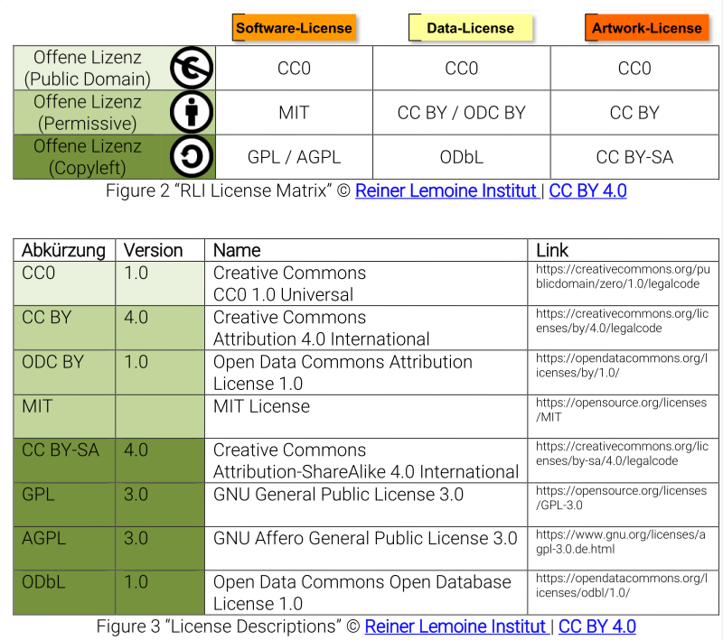

```{r include=FALSE}

if (! require("knitcitations")) {
  install.packages("knitcitations")
}

library("knitcitations")
cleanbib()
options("citation_format" = "pandoc")
```

# Introduction

The [Barcamp 'Open Science'](https://www.open-science-conference.eu/barcamp/)
took place on 12 March 2018 in the rooms of the Wikimedia Deutschland, 
Tempelhofer Ufer 23-24, 10963 Berlin. The event is organised by the 
[Leibnitz Research Allience Science 2.0](http://www.leibniz-science20.de/de/). 

Central aim of the Barcamp is to build a network between people working in the 
field of Open Science. Opposed to a Conference, the Barcamp concept follows a 
bottom-up approach.

Among the participants were researchers, software developers, librarians, e.g. 
from

- [Bielefeld GitLab](https://gitlab.ub.uni-bielefeld.de/)
- [Leibniz Institute for Astrophysics Potsdam (AIP)](http://www.aip.de/en/institute)
- [Open Science Radio](http://www.openscienceradio.org/)
- [Max Planck Institute for Human Development](https://www.mpg.de/149875/bildungsforschung)
- [Naturkundemuseum Berlin](https://www.museumfuernaturkunde.berlin/)

In the introduction round they named e.g. the following topics:

- Metadata
- Open Knowledge Maps
- Open Methods
- Open Research Data Quality
- Research Data Management
- Training Open Science
- Transparency
- Workflows

The Barcamp started with a session planning where topics for sessions of 45 
minutes duration were proposed.

# Content

- [Ignition Talk by Lambert Heller](#ignition-talk)
- [Session: What kind of tools should we use?](#session-tools)
- [Session: How do we motivate / reward doing Open Science?](#session-motivate)
- [Session: Software citation](#session-citation)
- [Session: Valid reasons for opting out of open science](#session-opt-out)
- [Session: CC0/PD vs. (CC)Licences for Open Science](#session-licence)
- [Session: Pain Points in Open Science](#session-pain)
- [Session: Research software publishing/repositories](#session-software)
- [Session: Metadata / Codebooks](#session-metadata)
- [Session: Open Knowledge Maps](#session-maps)
- [Session: Doing research outside academia / Citizen Science](#session-citizen)
- [OK-Lab Berlin: Presentation](#oklab)

# Ignition Talk by Lambert Heller {#ignition-talk}

- [Lambert Heller](https://vivo.tib.eu/fis/display/n0000-0003-0232-7085)

- Elsevier suggestion add geoblocking to open access

- Lessons-learnt: platforms require trust, but often exploit it!

- 2001: BitTorrent. It turned the Client-Server approach of the internet 
  upside-down

- 2013: Decentralised web movement (DAT). The "Dat Project" (A distributed data 
  community) started on [github](https://github.com/datproject).

- We have a "trusted platforms" problem in science

- Multiple tools are needed 

- The [GHTorrentProject](http://ghtorrent.org/), Debian CD images with BitTorrent

- Why move schoolary publishing to peer-to-peer (P2P) networks?

    1. In order to get their research done, researchers should be able to get hold 
of lots of data without additional effort. It is up to the research 
infrastructure. 

    2. We owe it to the scholarly work incorporated in that data

    3. Replacing privileged access with permissionless innovation levels the playing 
field for business model innovations.

- Pragmatic school, [https:/doi.org/ck99](https:/doi.org/ck99)

- Economic school 

**Internet Resources**

- [SciHub, global science and technology publisher, https://scihub.org/](https://scihub.org/)
- [Beaker, peer-to-peer browser, https://beakerbrowser.com/](https://beakerbrowser.com/)
- [ZeroNet, https://zeronet.io/](https://zeronet.io/)
- [Akasha: Completely decentralised social network, https://akasha.world/](https://akasha.world/)

# Session: What kind of tools should we use? {#session-tools}

[https://etherpad.wikimedia.org/p/workshop_OpenScienceFellows_BarcampSession5](https://etherpad.wikimedia.org/p/workshop_OpenScienceFellows_BarcampSession5)

**Background**

Sind Tools wie Hypothes.is und GitHub zu empfehlen? - Are tools like Hypothes.is 
and GitHub recommended for open science?

https://nextcloud.gbv.de/nextcloud/index.php/s/Rfg199D4xg0RptB

**Kriterien**

1 Quelloffen (source code is open)

2 Migration muss möglich sein (Exit-Strategie - eingebauter Knopf) - migration needs to be possible

3 Langfristig gesicherter Anbieter ( >10 Jahre) - offering should be long term (more than 1o years)

4 Vertrauenswürdiger Anbieter (Datenschutz, Non-profit, pro-Europe...) - trustful offering (e.g. data security, non-profit, pro-europe...)

5 Wissenschaftlich verlässlicher Anbieter. z.B. Fighshares hat keine Tombstone: https://doi.org/10.6084/M9.FIGSHARE.1381402 - Scientifically reliable provider. 

6 Sichtbarkeit (leicht in Google findbar) - visibility

7 Offene Beteiligungsmöglichkeit (externe Nutzer/Accounts leicht möglich) - open participation should be possible (external users/accounts)

8 Usability

A reference that should be considered: Bilder G, Lin J, Neylon C (2015) Principles for Open Scholarly Infrastructure-v1, retrieved [date], http://dx.doi.org/10.6084/m9.figshare.1314859“ - https://cameronneylon.net/blog/principles-for-open-scholarly-infrastructures/

**Notes**

- Liste mit Tools für 101 innovations: https://101innovations.wordpress.com/ (tool list of 101 innovations)

- Daten sind hier verfügbar: https://zenodo.org/record/49583#.WobxiRPwYWo (data from the list)

Reference: https://figshare.com/articles/NPOS_Workflow-perspective-Bosman-Kramer_pptx/5065534/1

**Applied Criteria**

ResearchGate: 6,  7, 8

Open Science Framework: 1, 2, 5, 6, 7, 8

FigShare 6, 7, 8

Zenodo 1, 2, 3, 4, 5, 6, 7, 8

Overleaf  2, 6, 7, 8

GitHub 2, 6, 7, 8

ScienceOpen

Criteria need to be applied:

arXiv 1?, 2?, 3, 4?, 5?, 6?, 7?, 8?

bioRxiv 1?, 2?, 3?, 4?, 5?, 6?, 7?, 8?

Jupyter 1?, 2?, 3?, 4?, 5?, 6?, 7?, 8?

Authorea 1?, 2?, 3?, 4?, 5?, 6?, 7?, 8?

MyExperiment 1?, 2?, 3?, 4?, 5?, 6?, 7?, 8?

protocols.io 1?, 2?, 3?, 4?, 5?, 6?, 7?, 8?

OpenNotebookScience 1?, 2?, 3?, 4?, 5?, 6?, 7?, 8?

GitLab (CE at institutions) 1?, 2?, 3?, 4?, 5?, 6?, 7?, 8?

Dryad 1?, 2?, 3?, 4?, 5?, 6?, 7?, 8?

Dataverse 1?, 2?, 3?, 4?, 5?, 6?, 7?, 8?

AsPredicted  1?, 2?, 3?, 4?, 5?, 6?, 7?, 8?

Hypothes.is 1?, 2?, 3?, 4?, 5?, 6?, 7?, 8?

Zotero 1, 2, 3?, 4?, 5?, 6?, 7?, 8?

RIO 1?, 2?, 3?, 4?, 5?, 6?, 7?, 8?

Eigene Blogwebseiten 1?, 2?, 3?, 4?, 5?, 6?, 7?, 8?

Twitter   1?, 2?, 3?, 4?, 5?, 6?, 7?, 8

## Barcamp Discussion

[https://etherpad.wikimedia.org/p/oscibar2018_session1](https://etherpad.wikimedia.org/p/oscibar2018_session1)

# Session: How do we motivate / reward doing Open Science? {#session-motivate}

[https://etherpad.wikimedia.org/p/oscibar2018_session5](https://etherpad.wikimedia.org/p/oscibar2018_session5)

Point of View: How open science helps researchers succeed [https://doi.org/10.7554/eLife.16800.001](https://doi.org/10.7554/eLife.16800.001)

Felix Schönbrodt: [https://twitter.com/nicebread303/status/973138967091654656](https://twitter.com/nicebread303/status/973138967091654656)


`r #knitcitations::citet("10.7554/eLife.16800.001")`

Discussion
[https://twitter.com/BrianNosek/status/949756218817630208](https://twitter.com/BrianNosek/status/949756218817630208)

Data stories:

- Good: [https://www.dataone.org/data-stories](https://www.dataone.org/data-stories)

- Bad: young researcher, who works in a lab who regulary perform scientific misconduct


# Session: Software citation {#session-citation}

[https://etherpad.wikimedia.org/p/oscibar2018_session10](https://etherpad.wikimedia.org/p/oscibar2018_session10)


# Session: Valid reasons for opting out of open science {#session-opt-out}

[https://etherpad.wikimedia.org/p/oscibar2018_session13](https://etherpad.wikimedia.org/p/oscibar2018_session13)

**Background:** 

[Opt-out policy in H2020](http://ec.europa.eu/research/participants/data/ref/h2020/other/wp/2018-2020/annexes/h2020-wp1820-annex-l-openaccess_en.pdf): 'projects can "opt-out" of these provisions before or after the signature of the grant agreement (thereby freeing themselves from the associated obligations) on the following grounds:' 

a)  Incompatibility with the Horizon 2020 obligation to protect results that are expected to be commercially or industrially exploited

b) Incompatibility with the need for confidentiality in connection with security issues

c) Incompatibility with rules on protecting personal data

d) Incompatibility with the project's main aim 

e) If the project will not generate / collect any research data, or

f) If there are other legitimate reasons not to provide open access to research data 

**Problem:**

To general. Too simple to out-out!

**Make the reasons more detailed!**

# Session: CC0/PD vs. (CC)Licences for Open Science {#session-licence}

[https://etherpad.wikimedia.org/p/oscibar2018_session17](https://etherpad.wikimedia.org/p/oscibar2018_session17)



[Source](https://cloud.rl-institut.de/index.php/s/oeWecd27pM4mAoG)


# Session: Pain Points in Open Science {#session-pain}

[https://etherpad.wikimedia.org/p/oscibar2018_session3](https://etherpad.wikimedia.org/p/oscibar2018_session3)

Pain Points:

- Replication studies are rejected for publication. Impact factor is old style 
but it is the currency you are paid
- Often, Open Data are not allowed or researchers do not want to open their data
- Tools, e.g. git is a pain to use
- Efforts: it takes money and resources to change things
- Project proposals are not focused on data

Solution:

- Allocate money
- You need supporting structures
- You need an Open Data Strategy! Strategy could be: publish metadata of 
sensitive data, together with a contact information. Then, people interested in 
the data can contact the owner of the data and a contract about what is allowed 
with the data can be made.
- [Birte Pfeiffer](https://www.giga-hamburg.de/en/team/pfeiffer) (Research data 
manager at GIGA, Hamburg): "You have to talk to the researchers! The question 
must be: How can I help you?"
- Take care of the data from the beginning -> Data management plan -> is a 
"living" document


# Session: Research software publishing/repositories {#session-software}

[https://etherpad.wikimedia.org/p/oscibar2018_session6](https://etherpad.wikimedia.org/p/oscibar2018_session6)

- Welche Probleme gibt es, Software zu finden?
- GitHub + DOI
- Allianzinitiative: FAIR principles
- Eigenentwicklung (wer?): Metadatenportal, nur aggregierte Daten, zugänglich 
ist ein (noch privates) GitHub repo, Software auf Django basierend
- [Anja Busch, Leibniz-Informationszentrum Wirtschaft](https://www.zbw.eu/de/forschung/science-2-0/anja-busch/): 
Metadaten-Harvesting
- [Birte Pfeiffer, GIGA Hamburg](https://www.giga-hamburg.de/en/team/pfeiffer): 
Suche nach Datenerhebungs-Tools -> Wie soll ich das alles testen?
- Sandbox-Anwendungen und Ansprechpartner sind wichtig zum Evaluieren von 
Software -> using [mybinder](https://mybinder.org/)?

**Resources**

[openscience.org, The OpenScience Project](http://openscience.org)
[de-rse.org, Research Software Engineers](http://www.de-rse.org/de/index.html)

# Session: Metadata / Codebooks {#session-metadata}

[https://etherpad.wikimedia.org/p/oscibar2018_session9](https://etherpad.wikimedia.org/p/oscibar2018_session9)

- standardised vs. flexible, concise vs. comprehensive, incentives vs. requirements
- [Ruben Arslan: Codebook](https://github.com/rubenarslan/codebook)
- [Data Documentation Initiative (DDI)](https://www.ddialliance.org/)
- Overview of metadata standards is missing
- Standards should "talk to each other"
- e.g. biodiversity: ontologies to map metadata, controlled vocabularies,
scientist does a pre-annotation, final annotation is done by a data curator 
(one per repository)
- [PANGAEA. Data Publisher for Earth & Environmental Science, https://www.pangaea.de/](https://www.pangaea.de/)
- each repository is using its own ontology and metadata standard
- collaboratively improve documentation of datasets in repositories?
- use wikidata for that?
- LabNotebook will automatically derive metadata
- **"It takes time to take the right standard and to use it"**
- [JasonLD: JSON for Linking Data, https://json-ld.org/](https://json-ld.org/)


# Session: Open Knowledge Maps {#session-maps}

[https://etherpad.wikimedia.org/p/oscibar2018_session14](https://etherpad.wikimedia.org/p/oscibar2018_session14)

- Open Knowledge Maps, [https://openknowledgemaps.org/](https://openknowledgemaps.org/) is a non-profit organisation
- [https://github.com/openknowledgemaps](https://github.com/openknowledgemaps)
- Knowledge Discovery
- Many papers remain uncited
- 85 % of published data remains uncited
- similar papers are placed in bubbles, based on text similarity
- [BASE: Bielefeld Academic Search Engine](https://www.base-search.net/)
- Partner: 
    + [ROpenSci: Transforming science through open data and software, https://ropensci.org/](https://ropensci.org/)
    + OpenUP


# Session: Doing research outside academia / Citizen Science {#session-citizen}

[https://etherpad.wikimedia.org/p/oscibar2018_session20](https://etherpad.wikimedia.org/p/oscibar2018_session20)

- [European Citizen Science Association (ECSA), https://ecsa.citizen-science.net/](https://ecsa.citizen-science.net/)
- Citizen Science: inclusion of members of the public in some aspect of
scientific research
- Levels:
    + 1: Crows sourcing (citizens as sensors)
    + 2: Distributed intelligence (Citizens as basic interpretors)
    + 3: ?
    + 4: ?
- [EyesOnALZ: find cloggings in blood vessels](http://hcjournal.org/wecurealz/)
- [BioBlitz](https://www.nationalgeographic.org/projects/bioblitz/)
- [ECSA: 10 Principles of Citizen Science](https://ecsa.citizen-science.net/engage-us/10-principles-citizen-science)


# OK-Lab Berlin: Presentation {#oklab}

- What is Open Data?
    + machine readable
    + open licences
    + without payment
    + sharing and remixing allowed
    + allowed for commercial purposes
- metadata: additional pdf or something
- Formats for open data in increasing quality: pdf -> xls -> csv -> rdf -> lod

Data portals

- [govdata.de](https://www.govdata.de/)
- [daten.berlin.de](http://daten.berlin.de)

Example applications

- [fragdenstaat.de](https://fragdenstaat.de/) 
- Swimming spots: [berlin.codefor.de/badestellen](http://berlin.codefor.de/badestellen/)
- Where can I buy vegetables?
- [schulsanierung.tursics.de](http://schulsanierung.tursics.de)
- [www.muenchen-transparent.de](https://www.muenchen-transparent.de/)
- [luftdaten.info](https://luftdaten.info/)
- [Deutsche Bahn Preiskalender, https://bahn.guru/](https://bahn.guru/)

References

- [Code for Germany, codefor.de](https://codefor.de/)


# Personal Contacts

**Alexander Struck, HU Berlin**: We may have a look at [Seafile](https://www.seafile.com/en/home/) as a software tool for storing our 
raw data.

# Wrap-up